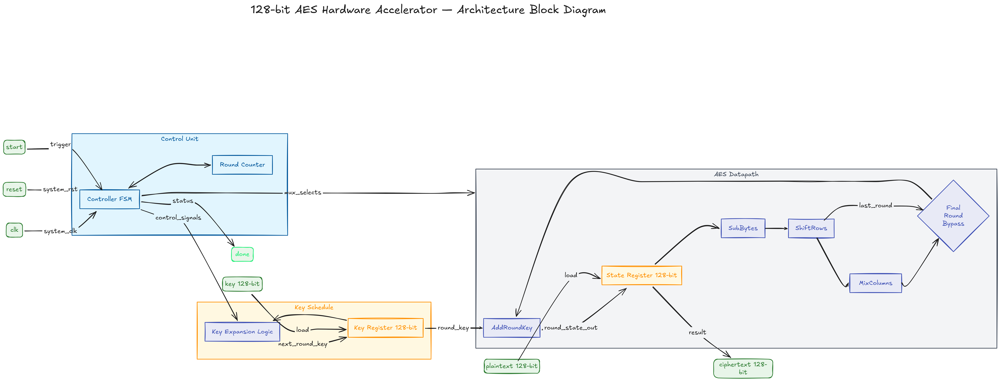
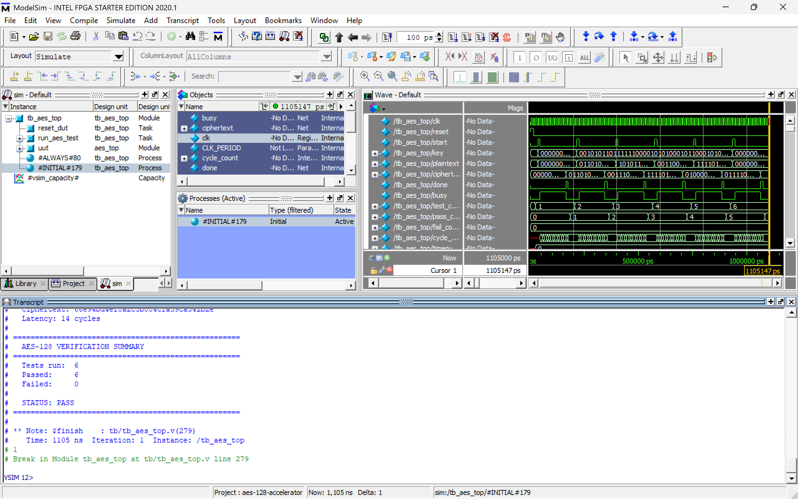
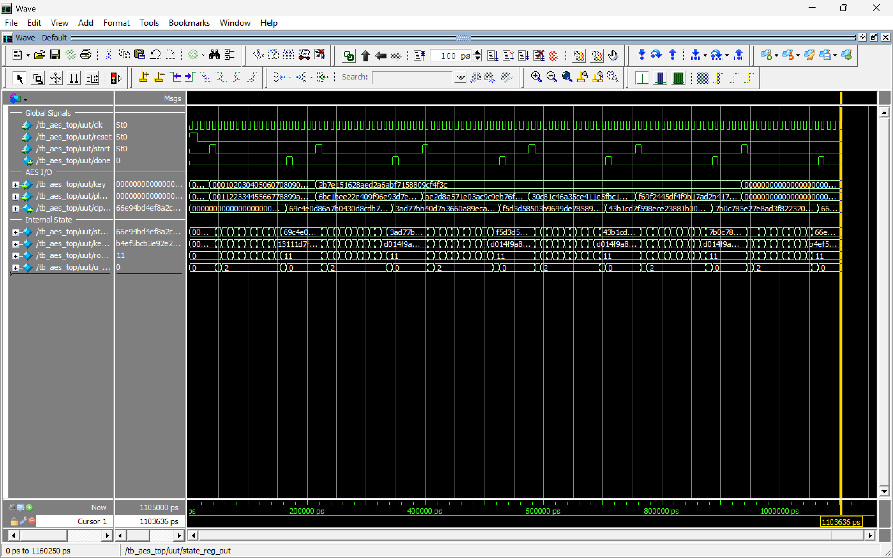

# AES-128 Hardware Accelerator

**Iterative RTL implementation of AES-128 encryption with reproducible verification, simulation, and synthesis flows.**

<p align="center">
  
</p>

> This project implements AES-128 encryption using a **single reusable round datapath**, registered state and key storage, on-the-fly key expansion, and a four-state FSM-based controller. All ten AES rounds share one combinational datapath; resource reuse is traded for throughput relative to a fully unrolled or pipelined design.

---

## Status

| Domain | Tool | Status |
|--------|------|--------|
| RTL Simulation | ModelSim-Intel FPGA Starter Edition 2020.1 | **Simulated � 6/6 PASS** |
| RTL Simulation | Questa | Script provided (`run_questa.do`) |
| Synthesis | Yosys | Not executed |
| FPGA Implementation | Quartus Prime | No `.qpf` project present � pending |
| FPGA Timing Analysis | Quartus TimeQuest | Pending |

---

## Project Overview

AES (Advanced Encryption Standard, FIPS-197) is the predominant symmetric cipher used in storage, communications, and embedded security. A hardware accelerator offloads the cipher computation from a host processor, reducing latency and CPU overhead for throughput-critical applications.

**Why iterative architecture?**  
An iterative design instantiates **one** AES round datapath and loops it ten times under FSM control. This minimises silicon area and FPGA resource consumption at the cost of throughput: one block is processed per 14 clock cycles rather than per 1 cycle (fully pipelined). For many embedded and FPGA applications, area is the binding constraint, making iterative architectures the correct engineering choice.

**Why AES-128?**  
AES-128 uses a 128-bit key, ten rounds, and remains approved under current NIST standards. It is the baseline algorithm targeted in FIPS-197 and represents the minimum key-size variant.

---

## Key Features

| Feature | Description |
|---------|-------------|
| AES-128 encryption | Full FIPS-197 compliant encryption, encryption-only |
| Iterative architecture | One round datapath reused across all 10 AES rounds |
| Shared AES round datapath | `aes_round.v`: SubBytes -> ShiftRows -> MixColumns -> AddRoundKey |
| Single shared S-box | One authoritative `sbox.v` used by both SubBytes and SubWord |
| On-the-fly key expansion | Next round key computed combinationally each cycle; no stored schedule |
| Four-state FSM | `IDLE -> INIT_ADD_KEY -> ROUND -> DONE` |
| 4-bit round counter | Synchronous, reset-able, counts rounds 0-10 |
| Registered state and key | Dedicated 128-bit registers; mux-controlled update |
| Self-checking testbenches | 8 testbenches, pass/fail reporting, first-mismatch detection |
| NIST known-answer tests | FIPS-197 Appendix B + NIST SP 800-38A F.1.1 (4 blocks) + all-zero |
| ModelSim simulation flow | `run_modelsim.do` -- compile, simulate, waveform, VCD |
| Questa simulation flow | `run_questa.do` -- identical flow, Questa-compatible |
| GTKWave VCD export | `$dumpfile` in testbench; VCD generated automatically |

---

## Architecture

### System Architecture

<p align="center">
  
</p>

The design partitions into three subsystems:

- **Control Unit** -- `controller.v` (FSM) + `round_counter.v`. Generates all datapath control signals and sequences the ten rounds.
- **Key Schedule** -- `key_expansion.v`, `rot_word.v`, `sub_word.v`, `rcon.v`. Computes the next 128-bit round key from the current key and round number, combinationally, each cycle.
- **AES Datapath** -- `aes_round.v`, `sub_bytes.v`, `shift_rows.v`, `mix_columns.v`, `add_round_key.v`, `sbox.v`, `state_register.v`, `key_register.v`. The state matrix flows through the round stages and is written back to the state register each clock cycle.

---

### AES Round Datapath

<p align="center">
  
</p>

The single round datapath (`aes_round.v`) is fully combinational. The `final_round` control signal selects a bypass path around MixColumns for round 10:

```
Normal rounds (1-9):   SubBytes -> ShiftRows -> MixColumns -> AddRoundKey
Final round (10):      SubBytes -> ShiftRows ----------------> AddRoundKey
```

---

### Key Expansion

<p align="center">
  
</p>

Key expansion is implemented on-the-fly: the `key_expansion` module computes `RK[i+1]` from `RK[i]` during the same clock cycle in which `RK[i]` is applied to the datapath. No expanded key schedule is stored. The algorithm follows FIPS-197 Section 5.2:

```
temp    = SubWord(RotWord(W[4i-1])) XOR Rcon[i]
W[4i]   = W[4i-4] XOR temp
W[4i+1] = W[4i-3] XOR W[4i]
W[4i+2] = W[4i-2] XOR W[4i+1]
W[4i+3] = W[4i-1] XOR W[4i+2]
```

---

### Control FSM

<p align="center">
  
</p>

The FSM has four states encoded in 3 bits:

| State | Encoding | Action |
|-------|----------|--------|
| `IDLE` | `3'd0` | Wait for `start`. On `start`: load plaintext and key, reset round counter. |
| `INIT_ADD_KEY` | `3'd1` | Compute `state = plaintext XOR key`. Update key register to RK1. Advance counter to 1. |
| `ROUND` | `3'd2` | Execute one AES round. Update state and key registers. Increment round counter. Transition to `DONE` when `round_number == 10`. |
| `DONE` | `3'd3` | Assert `done`, register ciphertext. Return to `IDLE`. |

The `busy` output is asserted combinationally whenever `current_state != IDLE`.

---

### Iterative Cycle Schedule

<p align="center">
  
</p>

---

## State / Byte Ordering

The design follows the FIPS-197 column-major byte ordering. The 128-bit `plaintext` vector is mapped to the 4x4 AES state matrix as:

| Bit range | State element | Matrix position |
|-----------|--------------|-----------------|
| `plaintext[127:120]` | `S[0][0]` | Row 0, Col 0 |
| `plaintext[119:112]` | `S[1][0]` | Row 1, Col 0 |
| `plaintext[111:104]` | `S[2][0]` | Row 2, Col 0 |
| `plaintext[103:96]`  | `S[3][0]` | Row 3, Col 0 |
| `plaintext[95:88]`   | `S[0][1]` | Row 0, Col 1 |
| ...                  | ...        | ...             |
| `plaintext[7:0]`     | `S[3][3]` | Row 3, Col 3 |

Bytes are loaded into the state matrix column-by-column. This matches the FIPS-197 convention and is confirmed by `shift_rows.v` where `state_in[127:120]` is extracted as `S[0][0]`.

---

## AES Algorithm

AES-128 operates on a 4x4 byte state matrix over 10 rounds. Each round (except the final) applies four transformations:

**SubBytes** -- Replace each byte with its S-box substitution. The S-box is defined over GF(2^8) (FIPS-197 Figure 7). In this implementation, a single combinational `sbox.v` module is shared across all 16 datapath substitutions and all 4 key-schedule substitutions.

**ShiftRows** -- Cyclically shift each row left by its row index:
- Row 0: no shift
- Row 1: left by 1 byte
- Row 2: left by 2 bytes
- Row 3: left by 3 bytes

`shift_rows.v` is implemented as pure wire routing with no logic gates.

**MixColumns** -- Treat each 4-byte column as a polynomial over GF(2^8) and multiply by the fixed polynomial `{03}x^3 + {01}x^2 + {01}x + {02}` modulo `x^4 + 1`. The `mix_columns.v` module implements this using `xtime()` (multiply by {02}) and `mul3()` (multiply by {03}) helper functions.

**AddRoundKey** -- XOR the state with the 128-bit round key. `add_round_key.v` is a single 128-bit XOR.

**Final round (round 10):** MixColumns is bypassed. The `final_round` signal from the FSM selects the post-ShiftRows output directly.

---

## Key Expansion

The key schedule computes each round key from the previous one using three sub-operations, implemented as separate modules:

| Module | Function |
|--------|----------|
| `rot_word.v` | Rotate a 32-bit word left by one byte: `{b1,b2,b3,b0}` |
| `sub_word.v` | Apply the S-box to each of the four bytes of a word (shares `sbox.v`) |
| `rcon.v` | Lookup table for the ten AES round constants `Rcon[1..10]` |

The key register stores the **current** round key at all times. The expansion module reads `key_reg_out` and produces `next_round_key` combinationally. The key register is updated at the end of each round.

All ten round-key derivations were verified against FIPS-197 Appendix A.1 by `tb_key_expansion.v`.

---

## Latency

**Measured latency: 14 clock cycles per 128-bit block.**

This was measured directly from the `transcript` file produced by the ModelSim simulation run on 2026-08-27. All six test cases report `Latency: 14 cycles`.

The cycle budget is accounted for as follows:

| Phase | Cycles |
|-------|--------|
| Reset deassert + input setup (external) | -- |
| `start` pulse asserted -- `IDLE` exits | 1 |
| `INIT_ADD_KEY` -- initial AddRoundKey, compute RK1 | 1 |
| `ROUND` x10 -- AES rounds 1-10 | 10 |
| `DONE` -- assert `done`, register ciphertext | 1 |
| Output registration (testbench wait) | 1 |
| **Total (as measured by testbench)** | **14** |

The testbench `cycle_count` starts after `start` is deasserted and increments on each `posedge clk` until `done` is observed. One additional cycle is waited before reading `ciphertext`, which accounts for the output register.

---

## Verification

### Strategy

<p align="center">
  
</p>

Verification is structured as three levels:

1. **Unit tests** -- each datapath and key schedule module is tested in isolation.
2. **Integration test** -- the complete `aes_top` is exercised with multiple NIST vectors.
3. **Known-answer tests (KAT)** -- ciphertext output is compared against published FIPS/NIST values.

All testbenches are self-checking: they display `PASS` or `FAIL` per test case with first-mismatch bit identification on failures.

---

### AES Known-Answer Test -- Primary Vector

**FIPS-197 Appendix B**

```
Key:       000102030405060708090A0B0C0D0E0F
Plaintext: 00112233445566778899AABBCCDDEEFF
Expected:  69C4E0D86A7B0430D8CDB78070B4C55A
```

**Result: PASS** -- simulated in ModelSim on 2026-08-27. Transcript extract:

```
--- Test 1: FIPS-197 Appendix B (Primary KAT) ---
  [Round  1] State: 00102030405060708090a0b0c0d0e0f0 | Key: d6aa74fdd2af72fadaa678f1d6ab76fe
  [Round  2] State: 89d810e8855ace682d1843d8cb128fe4 | Key: b692cf0b643dbdf1be9bc5006830b3fe
  [Round  3] State: 4915598f55e5d7a0daca94fa1f0a63f7 | Key: b6ff744ed2c2c9bf6c590cbf0469bf41
  [Round  4] State: fa636a2825b339c940668a3157244d17 | Key: 47f7f7bc95353e03f96c32bcfd058dfd
  [Round  5] State: 247240236966b3fa6ed2753288425b6c | Key: 3caaa3e8a99f9deb50f3af57adf622aa
  [Round  6] State: c81677bc9b7ac93b25027992b0261996 | Key: 5e390f7df7a69296a7553dc10aa31f6b
  [Round  7] State: c62fe109f75eedc3cc79395d84f9cf5d | Key: 14f9701ae35fe28c440adf4d4ea9c026
  [Round  8] State: d1876c0f79c4300ab45594add66ff41f | Key: 47438735a41c65b9e016baf4aebf7ad2
  [Round  9] State: fde3bad205e5d0d73547964ef1fe37f1 | Key: 549932d1f08557681093ed9cbe2c974e
  [Round 10] State: bd6e7c3df2b5779e0b61216e8b10b689 | Key: 13111d7fe3944a17f307a78b4d2b30c5
PASS: FIPS-197 Appendix B
  Ciphertext: 69c4e0d86a7b0430d8cdb78070b4c55a
  Latency: 14 cycles
```

---

### Test Matrix

| Test | Testbench | Vectors | Tool | Status |
|------|-----------|---------|------|--------|
| S-box spot checks (20 values, FIPS-197 Fig. 7) | `tb_sbox.v` | 20 | ModelSim | PENDING |
| SubBytes | `tb_sub_bytes.v` | -- | ModelSim | PENDING |
| ShiftRows | `tb_shift_rows.v` | -- | ModelSim | PENDING |
| MixColumns | `tb_mix_columns.v` | -- | ModelSim | PENDING |
| AddRoundKey | `tb_add_round_key.v` | -- | ModelSim | PENDING |
| Key expansion -- all 10 round keys, FIPS-197 App. A.1 | `tb_key_expansion.v` | 10 | ModelSim | PENDING |
| AES round -- rounds 1, 2, 10 from FIPS-197 App. B | `tb_aes_round.v` | 3 | ModelSim | PENDING |
| Integration -- FIPS-197 App. B | `tb_aes_top.v` | 1 | ModelSim | **PASS** |
| Integration -- NIST SP 800-38A F.1.1 Blocks 1-4 | `tb_aes_top.v` | 4 | ModelSim | **PASS** |
| Integration -- all-zero key and plaintext | `tb_aes_top.v` | 1 | ModelSim | **PASS** |

> **Note:** The integration testbench `tb_aes_top.v` exercises the full `aes_top` hierarchy with self-checking pass/fail reporting. The unit testbenches (`tb_sbox.v`, `tb_aes_round.v`, etc.) exist in `tb/` and are configured with NIST vectors; they have not yet been run through the automated `.do` script. Status is marked **PENDING** accordingly.

---

## Evidence

### ModelSim -- Integration Testbench Result (6/6 PASS)

<p align="center">
  
</p>

*ModelSim transcript showing `STATUS: PASS`, `Tests run: 6`, `Passed: 6`, `Failed: 0` at simulation time 1105 ns.*

---

### ModelSim -- Waveform

<p align="center">
  
</p>

*Waveform view showing six sequential AES encryption transactions. Signals shown: `clk`, `reset`, `start`, `done`, `key`, `plaintext`, `ciphertext`, `state_reg_out`, `key_reg_out`, `round_number`, `current_state`.*

---

## Simulation Flows

### ModelSim

```tcl
# In ModelSim GUI transcript window:
do run_modelsim.do

# Or from command line (batch mode):
vsim -c -do run_modelsim.do
```

`run_modelsim.do` performs:
1. Deletes and recreates the `work` library.
2. Compiles `rtl/datapath/*.v`, `rtl/key_schedule/*.v`, `rtl/*.v`, `tb/tb_aes_top.v`.
3. Starts simulation with `vsim -voptargs="+acc"` (full signal visibility).
4. Adds global signals, AES I/O, and internal state signals to the Wave window.
5. Runs to `$finish`.
6. Saves the waveform format to `aes_modelsim.do` and exports the session to `aes_waveform.wlf`.
7. Checks for `aes_top.qpf` and, if present, invokes Quartus via `quartus_sh --flow compile`.

**Compilation result (verified):** Zero errors, zero warnings.

---

### Questa

```tcl
# In Questa GUI transcript window:
do run_questa.do

# Or from command line (batch mode):
vsim -c -do run_questa.do
```

`run_questa.do` is functionally identical to `run_modelsim.do`. The only difference is that the saved waveform format file is named `aes_questa.do`. Both scripts use the same `vsim`/`vlog` command syntax, which is compatible with both tool editions.

---

### Icarus Verilog + GTKWave

The top-level testbench unconditionally dumps a VCD file:

```verilog
initial begin
    $dumpfile("aes_top.vcd");
    $dumpvars(0, tb_aes_top);
end
```

To simulate with Icarus Verilog and view in GTKWave:

```bash
# Compile
iverilog -o aes_sim \
  rtl/datapath/*.v \
  rtl/key_schedule/*.v \
  rtl/*.v \
  tb/tb_aes_top.v

# Simulate
vvp aes_sim

# View waveform
gtkwave aes_top.vcd
```

> **Note:** Icarus Verilog compilation has not been formally executed and validated as part of this project. The commands above follow standard Icarus usage; the RTL uses no constructs that would prevent compilation.

---

## Quartus / FPGA Flow

No Quartus project file (`.qpf`) is present in the repository. The simulation scripts check for `aes_top.qpf` and report:

```
-> No Quartus project (aes_top.qpf) found in root directory.
-> Skipping Quartus Synthesis and FPGA implementation.
```

When a Quartus project is created, the intended flow is:

1. **Add RTL** -- add all files under `rtl/` to the project.
2. **Select target device** -- choose an Intel FPGA (e.g., Cyclone IV, Cyclone V, or MAX 10).
3. **Add timing constraints** -- create a `.sdc` file with a clock constraint.
4. **Analysis and Synthesis** -- `quartus_map`.
5. **Fitter** -- `quartus_fit`.
6. **Timing Analyzer (TimeQuest)** -- `quartus_sta`.
7. **Assembler** -- `quartus_asm` -- generates `.sof`.

---

## Static Timing Analysis

Timing results depend on the target device, speed grade, and synthesis constraints. No Quartus project has been executed.

> **Timing results pending target-device implementation.**

When results are available, the following metrics will be reported: clock constraint, setup slack (worst case), hold slack, Fmax, and the critical path (expected to pass through the MixColumns GF(2^8) multiplications or the S-box combinational logic).

---

## Hardware Results

No synthesis or place-and-route results are available at this time.

| Metric | Result |
|--------|--------|
| FPGA Device | Pending |
| Logic Elements / LUTs | Pending |
| Registers | Pending |
| Memory Bits | Pending |
| DSP Blocks | Pending |
| Fmax | Pending |
| Worst Setup Slack | Pending |
| Latency (measured, simulation) | **14 cycles** |
| Throughput | Pending |

**Throughput formula** (for reference, once Fmax is measured):

```
Throughput = (128 bits x Fmax) / 14 cycles
           = 9.14 x Fmax  [Mbit/s, with Fmax in MHz]
```

---

## Architecture Comparison

*Qualitative comparison. Values are directional indicators, not measurements from this repository.*

| Architecture | Area | Latency (cycles/block) | Throughput | Design Complexity |
|--------------|------|------------------------|------------|-------------------|
| **Iterative (this design)** | **Low** | **Higher (14)** | **Lower** | **Low** |
| Partially unrolled (2 or 5 rounds/cycle) | Medium | Medium | Medium | Medium |
| Fully unrolled (10 round instances) | High | Low (~2) | High | Medium |
| Pipelined | High | Low (1 cycle, high throughput) | Very high | High |

---

## Repository Structure

```
aes-128-accelerator/
|-- rtl/
|   |-- aes_top.v              # Top-level module (iterative core, 14-cycle latency)
|   |-- controller.v           # FSM controller (4 states)
|   |-- round_counter.v        # 4-bit synchronous round counter
|   |-- state_register.v       # 128-bit registered state with mux
|   |-- key_register.v         # 128-bit registered key with mux
|   |-- datapath/
|   |   |-- aes_round.v        # Single AES round datapath (combinational)
|   |   |-- sub_bytes.v        # 16x sbox instantiation
|   |   |-- shift_rows.v       # Pure wire rotation
|   |   |-- mix_columns.v      # GF(2^8) column mixing
|   |   |-- add_round_key.v    # 128-bit XOR
|   |   `-- sbox.v             # Shared S-box (256-entry LUT, FIPS-197 Fig. 7)
|   `-- key_schedule/
|       |-- key_expansion.v    # On-the-fly round key derivation
|       |-- rot_word.v         # Byte rotation
|       |-- sub_word.v         # 4x sbox instantiation
|       `-- rcon.v             # Round constant lookup (Rcon[1..10])
|-- tb/
|   |-- tb_aes_top.v           # Integration testbench (6 NIST vectors, self-checking)
|   |-- tb_aes_round.v         # Unit test: AES round (3 vectors, FIPS-197 App. B)
|   |-- tb_key_expansion.v     # Unit test: key expansion (10 round keys, FIPS-197 App. A.1)
|   |-- tb_sbox.v              # Unit test: S-box (20 spot-checks)
|   |-- tb_sub_bytes.v         # Unit test: SubBytes
|   |-- tb_shift_rows.v        # Unit test: ShiftRows
|   |-- tb_mix_columns.v       # Unit test: MixColumns
|   `-- tb_add_round_key.v     # Unit test: AddRoundKey
|-- docs/
|   |-- Untitled-2026-08-27-0242.png   # System architecture diagram (primary)
|   |-- Untitled-2026-08-27-0242.svg
|   |-- AES Round Datapath.png
|   |-- AES Round Datapath.svg
|   |-- AES-128 Key Expansion.png
|   |-- AES-128 Key Expansion.svg
|   |-- Control FSM.png
|   |-- Control FSM.svg
|   |-- Iterative Cycle _ Timing Diagram.png
|   |-- Iterative Cycle _ Timing Diagram.svg
|   |-- Verification Flow.png
|   |-- Verification Flow.svg
|   |-- 02_modelsim_compile.png        # Compilation screenshot
|   |-- 03_aes_kat_pass.png            # Integration testbench PASS screenshot (6/6)
|   `-- modelsim_waveform.png          # Waveform screenshot
|-- sim/
|   `-- aes_modelsim.do        # Saved ModelSim waveform format
|-- run_modelsim.do             # ModelSim automation script
|-- run_questa.do               # Questa automation script
|-- aes_modelsim.do             # Saved wave format (generated by run_modelsim.do)
|-- transcript                  # ModelSim simulation transcript (2026-08-27)
|-- aes-128-accelerator.mpf     # ModelSim project file
`-- .gitignore
```

---

## Design Decisions

| Decision | Rationale |
|----------|-----------|
| Iterative architecture | Minimises logic area by sharing the round datapath across all 10 rounds. Area-optimal for constrained FPGAs and embedded targets. |
| Single shared S-box | One authoritative `sbox.v` eliminates duplication. Both SubBytes (16 instances) and SubWord (4 instances) reference the same module, reducing synthesis area and ensuring consistency. |
| On-the-fly key expansion | Eliminates the need to store ten precomputed round keys (10 x 128 = 1280 bits of registers). One `key_expansion` module computes the next key combinationally each cycle. |
| Registered state and key | State and key are stored in dedicated synchronous registers with explicit load/update control, making the pipeline structure explicit and synthesis-friendly. |
| Combinational FSM outputs | Outputs depend on `current_state` (and `round_number` for `final_round`), computed combinationally. This avoids an extra pipeline stage to produce control signals. |
| Vendor-neutral RTL | The RTL uses no vendor primitives. It targets any standard Verilog synthesis tool. |
| Separate `.do` scripts | `run_modelsim.do` and `run_questa.do` provide a one-command reproducible simulation environment for both tool chains without requiring a Makefile. |

---

## Limitations

The following limitations apply to the current implementation:

- **Encryption only** -- no AES decryption (`InvSubBytes`, `InvShiftRows`, `InvMixColumns`) is implemented.
- **AES-128 only** -- AES-192 and AES-256 key schedules and extended round counts are not supported.
- **No block-cipher modes** -- no ECB chaining, CBC, CTR, GCM, or similar. The core processes a single 128-bit block per transaction.
- **No pipelining** -- throughput is limited to one block per 14 clock cycles.
- **No side-channel countermeasures** -- the implementation is not hardened against timing or power side-channel attacks. No masking, constant-time S-box, or fault-detection logic is present.
- **FPGA results not yet available** -- synthesis, placement, routing, and timing analysis have not been performed.
- **Unit testbench execution not automated** -- the unit testbenches in `tb/` are not yet integrated into the `.do` automation scripts.

---

## Future Work

### Level 1 -- Verification Completeness
- Integrate all unit testbenches into the `.do` automation scripts.
- Expand the integration testbench with additional NIST SP 800-38A ECB vectors.
- Add a Python or C reference model to generate and cross-check additional test vectors.

### Level 2 -- FPGA Implementation
- Create a Quartus project targeting a representative Intel FPGA device.
- Add a `.sdc` timing constraints file.
- Report resource utilisation (LEs/LUTs, registers, memory, DSPs) and Fmax.
- Optimise critical path (likely MixColumns GF multiplication or S-box).

### Level 3 -- Architecture Extensions
- **Decryption** -- implement the inverse key schedule and inverse round transformations.
- **Partial unrolling** -- process 2 or 5 rounds per cycle to increase throughput with moderate area increase.
- **Pipelining** -- ten-stage pipeline for maximum throughput.
- **AES modes** -- CBC, CTR, and GCM mode wrappers.
- **AES-192 / AES-256** -- extend the key schedule and round counter.

### Level 4 -- Hardening
- Side-channel countermeasures (Boolean masking, constant-time S-box).
- Fault-injection detection (output duplication or parity checks).
- RISC-V peripheral integration (AHB/APB bus interface).

---

## Reproducibility

### Clone

```bash
git clone https://github.com/Abdelwakil-Mansour/AES-128-Hardware-Accelerator.git
cd AES-128-Hardware-Accelerator
```

### Run with ModelSim (Intel FPGA Edition)

```tcl
# Open ModelSim. In the transcript window:
do run_modelsim.do
```

Expected output: `STATUS: PASS`, `Tests run: 6`, `Passed: 6`, `Failed: 0`, simulation time 1105 ns.

### Run with Questa

```tcl
# Open Questa. In the transcript window:
do run_questa.do
```

### Run with Icarus Verilog + GTKWave

```bash
iverilog -o aes_sim \
  rtl/datapath/*.v \
  rtl/key_schedule/*.v \
  rtl/*.v \
  tb/tb_aes_top.v

vvp aes_sim
gtkwave aes_top.vcd
```

### Tool Versions Used

| Tool | Version |
|------|---------|
| ModelSim | Intel FPGA Starter Edition 2020.1 (vlog 2020.02, Feb 28 2020) |
| Questa | Compatible with `run_questa.do`; specific version not recorded |
| Icarus Verilog | Not formally executed |
| Yosys | Not executed |
| Quartus Prime | Not executed (no `.qpf` present) |

---

## Team

| Role | Contributor |
|------|-------------|
| Datapath design (`aes_round`, `sub_bytes`, `shift_rows`, `mix_columns`, `add_round_key`, `sbox`) | Person 1 |
| Key schedule (`key_expansion`, `rot_word`, `sub_word`, `rcon`, `key_register`) | Person 2 |
| Control and integration (`controller`, `round_counter`, `state_register`, `aes_top`, testbenches, scripts) | Person 3 |

---

## References

- NIST FIPS-197, *Specification for the Advanced Encryption Standard (AES)*, November 2001.
- NIST SP 800-38A, *Recommendation for Block Cipher Modes of Operation*, 2001.
- ModelSim-Intel FPGA Starter Edition 2020.1 documentation.
