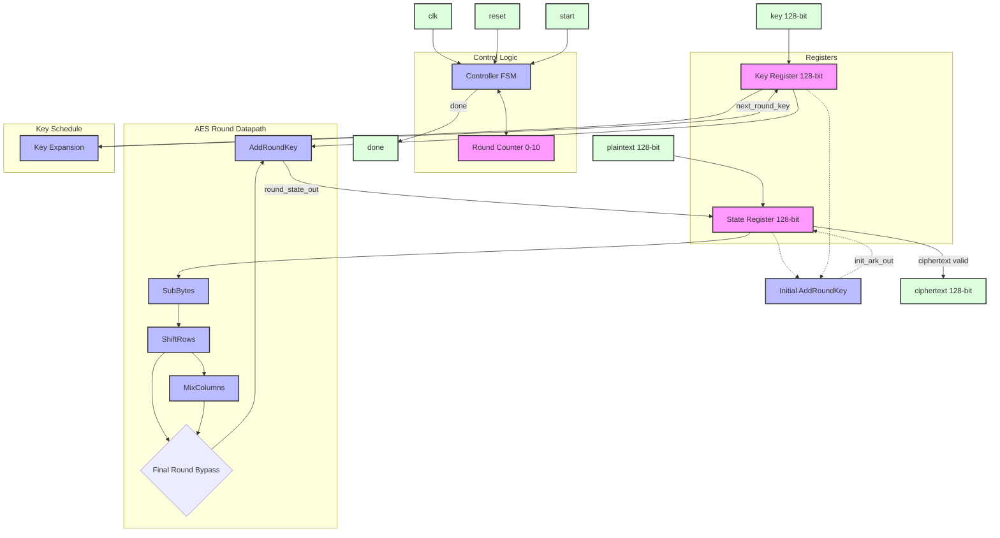

```mermaid
graph TD
    %% Main Inputs
    clk[clk] --> FSM
    reset[reset] --> FSM
    start[start] --> FSM
    key[key 128-bit] --> KeyReg
    pt[plaintext 128-bit] --> StateReg

    %% FSM Controller
    subgraph Control Logic
        FSM[Controller FSM]
        RC[Round Counter 0-10]
        FSM <--> RC
    end

    %% Registers
    subgraph Registers
        StateReg[State Register 128-bit]
        KeyReg[Key Register 128-bit]
    end

    %% AES Round Datapath
    subgraph AES Round Datapath
        SB[SubBytes]
        SR[ShiftRows]
        MC[MixColumns]
        Bypass{Final Round Bypass}
        ARK[AddRoundKey]
        
        SB --> SR
        SR --> MC
        SR --> Bypass
        MC --> Bypass
        Bypass --> ARK
    end

    %% Key Expansion
    subgraph Key Schedule
        KE[Key Expansion]
    end

    %% Connections
    StateReg --> SB
    KeyReg --> ARK
    KeyReg --> KE

    ARK -->|round_state_out| StateReg
    KE -->|next_round_key| KeyReg

    %% Initial AddRoundKey
    StateReg -.-> InitARK[Initial AddRoundKey]
    KeyReg -.-> InitARK
    InitARK -.->|init_ark_out| StateReg

    %% Outputs
    FSM -->|done| DoneOut[done]
    StateReg -->|ciphertext valid| CT[ciphertext 128-bit]

    %% Styling
    classDef reg fill:#f9f,stroke:#333,stroke-width:2px;
    classDef logic fill:#bbf,stroke:#333,stroke-width:2px;
    classDef io fill:#dfd,stroke:#333,stroke-width:2px;
    
    class StateReg,KeyReg,RC reg;
    class SB,SR,MC,ARK,KE,InitARK,FSM logic;
    class clk,reset,start,key,pt,CT,DoneOut io;
```
